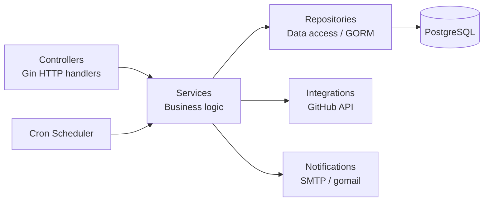

# GitHub Release Notification API

## 0. Project Overview

A Go REST API that lets users subscribe to email notifications about new releases of any public GitHub repository. When a tracked repository publishes a new release, every confirmed subscriber receives an email with the update details.

**Core workflow:**

1. A user subscribes by providing their email and a GitHub repository (`owner/repo`).
2. The system validates the repository via the GitHub API and sends a confirmation email with a unique token.
3. The user confirms the subscription by following the link in the email.
4. A cron job periodically polls the GitHub API for new releases; when a new tag is detected, all confirmed subscribers are notified via email.
5. Users can unsubscribe at any time using a token included in every notification email.

**Key technologies:**

| Concern | Technology |
|---|---|
| Language | Go 1.26 |
| HTTP framework | [Gin](https://github.com/gin-gonic/gin) |
| ORM / Database | [GORM](https://gorm.io) + PostgreSQL 16 |
| GitHub client | [go-github v84](https://github.com/google/go-github) |
| Email delivery | SMTP via [gomail](https://github.com/go-gomail/gomail) |
| Cron scheduler | [robfig/cron](https://github.com/robfig/cron) |
| Configuration | [Viper](https://github.com/spf13/viper) + [godotenv](https://github.com/joho/godotenv) |
| Logging | [zap](https://go.uber.org/zap) |
| API docs | [Swagger / swag](https://github.com/swaggo/swag) |
| Linting | [golangci-lint](https://golangci-lint.run) |
| Git hooks | [Lefthook](https://github.com/evilmartians/lefthook) |
| Containerisation | Docker multi-stage build + Docker Compose |

---

## 1. How to Run

### Prerequisites

- **Go ≥ 1.26**
- **PostgreSQL 16** (or use the Docker Compose setup)
- **Docker & Docker Compose** (for the containerised path)
- A **GitHub personal access token** (classic, with `public_repo` scope is enough)
- SMTP credentials for sending emails (e.g. Gmail App Password, Mailtrap, etc.)

### Environment variables

Copy the example file and fill in real values:

```bash
cp .env.example .env
```

| Variable | Description |
|---|---|
| `DB_DSN` | PostgreSQL connection string |
| `SERVER_PORT` | HTTP port the server listens on (default `8080`) |
| `SERVER_API_KEY` | Static API key for the `X-API-Key` header (leave empty to disable auth) |
| `GITHUB_TOKEN` | GitHub personal access token |
| `MAILER_HOST` | SMTP host |
| `MAILER_PORT` | SMTP port (e.g. `587`) |
| `MAILER_USERNAME` | SMTP username |
| `MAILER_FROM` | Sender email address |
| `MAILER_SMTP` | SMTP server address |
| `MAILER_PASSWORD` | SMTP password |
| `CRON_REPO_CHECK_SCHEDULE` | Cron expression for release polling (default `0 * * * *` — every hour) |
| `POSTGRES_USER` | Postgres user (used by the Docker Compose postgres container) |
| `POSTGRES_PASSWORD` | Postgres password |
| `POSTGRES_DB` | Postgres database name |

### Run locally

```bash
# 1. Install dependencies
make dependencies        # runs go mod tidy && go mod download

# 2. Make sure PostgreSQL is running and DB_DSN in .env points to it

# 3. Start the server
go run cmd/main.go
```

The server starts on the port defined by `SERVER_PORT` (default `8080`).
Swagger UI is available at `http://localhost:8080/swagger/index.html`.

### Run with Docker Compose

```bash
# Build and start both the backend and PostgreSQL containers
docker compose up --build
```

This will:
- Start a **PostgreSQL 16** container with a health-check.
- Build the Go binary inside a multi-stage Docker image and start the **backend** container.
- Expose the API on the port specified by `SERVER_PORT` in your `.env`.

To stop:

```bash
docker compose down
```

### Useful Makefile targets

| Target | Description |
|---|---|
| `make dependencies` | `go mod tidy` + `go mod download` |
| `make lint` | Run `golangci-lint` (auto-installs if missing) |
| `make swagger` | Regenerate Swagger docs from annotations into `docs/generated/` |

### Git hooks (Lefthook)

Pre-commit hooks run **linting** and **Swagger docs regeneration** in parallel. Install with:

```bash
go run github.com/evilmartians/lefthook/v2 install
```

---

## 2. Project Structure

```
.
├── cmd/
│   └── main.go                          # Application entry-point
├── docs/
│   ├── source-swagger.yaml              # Hand-written OpenAPI 2.0 spec
│   └── generated/                       # Auto-generated Swagger files (swag init)
├── internal/
│   ├── config/                          # Configuration structs & .env loader (Viper)
│   ├── controllers/                     # HTTP handlers (Gin) & route registration
│   │   ├── middlewares/                 # CORS and API-key middlewares
│   │   ├── router.go                   # Route definitions
│   │   ├── subscription.go             # Subscription endpoint handlers
│   │   └── errors.go                   # Centralised HTTP error mapping
│   ├── cron/                            # Cron scheduler (robfig/cron)
│   ├── infrastructure/
│   │   └── db/                          # GORM database connection & auto-migration
│   ├── integrations/
│   │   └── github/                      # GitHub API client (go-github)
│   ├── models/                          # GORM domain models & DTOs
│   │   ├── subscription.go             # Subscription model
│   │   ├── repository.go               # Repository model
│   │   ├── code.go                     # Confirmation / unsubscribe code model
│   │   └── dto/                        # Request / response DTOs
│   ├── notifications/                   # Email notification orchestration
│   │   ├── mailer/                     # Low-level SMTP sending (gomail)
│   │   └── templates/                  # HTML email templates & rendering
│   │       └── htmls/                  # Raw HTML template files
│   ├── repositories/                    # Data-access layer (GORM queries)
│   │   ├── code/                       # Code repository
│   │   ├── repository/                 # Repository repository
│   │   └── subscription/               # Subscription repository
│   ├── services/                        # Business logic layer
│   │   ├── repository/                 # Release-check & notification dispatch
│   │   └── subscription/               # Subscribe / confirm / unsubscribe / list
│   └── utils/                           # Shared helpers (e.g. code generation)
├── .env.example                         # Environment variable template
├── .golangci.yml                        # Linter configuration
├── docker-compose.yml                   # Docker Compose (backend + postgres)
├── Dockerfile                           # Multi-stage Docker build
├── lefthook.yml                         # Git hook definitions
├── Makefile                             # Build / lint / swagger targets
├── go.mod / go.sum                      # Go module files
└── README.md
```

The codebase follows a **layered architecture**:



Every layer communicates through **Go interfaces**, making it straightforward to mock dependencies in tests.

---

## 3. API Overview

All endpoints are served under the `/api` base path and require the `X-API-Key` header (unless `SERVER_API_KEY` is left empty).

Interactive Swagger UI is available at **`/swagger/index.html`** when the server is running.

## 4. Future improvements

1. Switch to the external notifications provider.
2. Add Github API responses caching with Redis.
3. Add integrations tests.